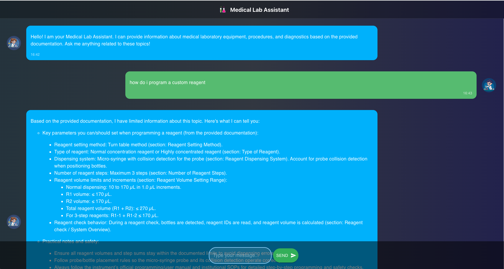

# Medical Chatbot LLM

## Overview
A concept application designed specifically for medical laboratory environments, leveraging Large Language Models (LLMs) to provide intelligent, context-aware responses to complex procedural and technical queries.

## Problem Statement

Traditional keyword-based document searches are fundamentally limited in medical laboratory contexts, where:

- **Complex Procedures**: Laboratory protocols often involve multi-step processes that can't be adequately described with simple keywords
- **Technical Terminology**: Medical and laboratory jargon varies significantly across institutions and equipment manufacturers
- **Context Dependencies**: The relevance of information often depends on specific sample types, reagent combinations, or equipment states
- **Limited Search Results**: Keyword searches return exact matches only, missing related procedures, troubleshooting steps, or alternative methods
- **User Experience**: Laboratory technicians need quick, accurate answers without sifting through irrelevant search results

## Solution

This project implements a Retrieval-Augmented Generation (RAG) system that:

1. **Semantic Understanding**: Uses advanced embeddings to understand the meaning behind questions, not just keyword matches
2. **Context-Aware Retrieval**: Retrieves relevant documentation based on semantic similarity and context
3. **Intelligent Responses**: Generates human-like answers that synthesize information from multiple sources
4. **Continuous Learning**: Can be updated with new documentation without retraining the entire system

## Architecture

```mermaid
graph TD
    A[Information Storage <br/>(PDF Documents)] --> B(Chunking);
    B --> C{Transformers <br/>(Sentence Embeddings)};
    C --> D[Vector Database <br/>(Pinecone)];
    E[User Query] --> F{Transformers <br/>(Sentence Embeddings)};
    F --> G(Similarity Search);
    D -- Retrieved Context --> G;
    G --> H[LLM <br/>(OpenAI GPT)];
    E -- Original Query --> H;
    H --> I[Generated Response];
```

1.  **Information Storage (PDF Documents)**: The process begins with storing the knowledge base, which consists of PDF documents, in the `data/` directory. The `PyPDFLoader` from LangChain is used to load these documents into memory.

2.  **Chunking**: The loaded documents are then broken down into smaller, manageable chunks. This is achieved using LangChain's `RecursiveCharacterTextSplitter`, which splits the text to ensure that no single chunk is too large for the model's context window, while maintaining semantic coherence.

3.  **Transformers (Sentence Embeddings)**: Each text chunk is converted into a numerical vector representation (embedding). This project uses the `all-MiniLM-L6-v2` model from HuggingFace's `sentence-transformers` library. This same embedding model is used for both indexing the documents and processing user queries to ensure they are in the same vector space.

4.  **Vector Database (Pinecone)**: The generated embeddings are stored in a Pinecone index, a specialized vector database. This allows for efficient, large-scale similarity searches. The `store_index.py` script handles the creation of the index and the uploading of the document vectors.

5.  **User Query & Similarity Search**: When a user submits a query, the application embeds the query using the same HuggingFace model. It then queries the Pinecone database to retrieve the document chunks with embeddings that are most semantically similar to the query's embedding. This is the "Retrieval" part of RAG.

6.  **LLM (OpenAI GPT)**: The retrieved document chunks (the context) and the original user query are combined into a single prompt. This project uses a custom prompt template defined in `src/prompt.py`. The combined prompt is then sent to an OpenAI GPT model (`gpt-5-mini`).

7.  **Generated Response**: The LLM synthesizes the information from the retrieved context to generate a relevant and coherent answer to the user's query. This answer is then sent back to the user through the Flask API.

## Key Features

- **PDF Document Processing**: Automatically extracts and chunks technical documentation
- **Vector Database**: Stores document embeddings in Pinecone for fast similarity search
- **LLM Integration**: Uses OpenAI's GPT models for natural language understanding and response generation
- **Medical Domain Expertise**: Specialized prompts for medical laboratory equipment and procedures
- **Scalable Architecture**: Easy to add new documents and update existing knowledge base

## Use Cases

- **Equipment Troubleshooting**: Quick answers to analyzer errors and maintenance procedures
- **Protocol Guidance**: Step-by-step instructions for complex laboratory procedures
- **Quality Control**: Information about QC profiles, calibration procedures, and validation
- **Training Support**: On-demand reference for laboratory technicians and staff

## Technology Stack

- **LangChain**: Framework for building LLM applications
- **Pinecone**: Vector database for semantic search
- **OpenAI GPT**: Large language model for natural language processing
- **HuggingFace**: Sentence transformers for document embeddings
- **PyPDF**: PDF text extraction and processing

## Getting Started
Live Demo: https://rag-medlab-frontend.onrender.com/

To test locally and upload your own knowledge base: 

1. Install dependencies: `pip install -r requirements.txt`
2. Set up environment variables for API keys
3. Place PDF documentation in the `data/` directory
4. Run the notebook to process documents and build the knowledge base
5. Use the chatbot interface for queries

## Future Enhancements

- Faster response time
- Integration with laboratory information systems
- Real-time document updates
- User feedback and response quality tracking